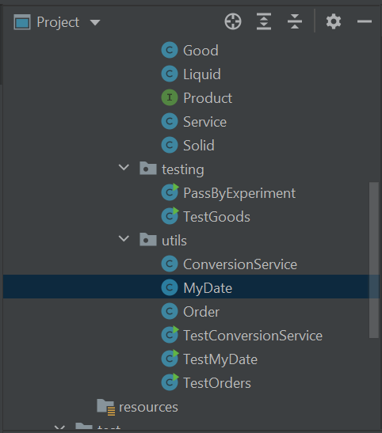

# Java-Polymorphism-Lab-Section-11

Polymorphism allows an object reference of a generic type to point to an object of a
more specific type. For example, a Good reference can point to a Solid or Liquid
product object. In this lab, you use polymorphism to assign any type of good to an
order’s product field. You also explore the equals( ) method to compare MyDate
objects.

Specifically, in this lab you will:
* Update the Order type to use polymorphism and the good type hierarchy (Good,
Liquid, Solid) for products, rather than using a string
* Update MyDate to override the polymorphic equals( ) method from
java.lang.Object.
* Optionally explore the cast operation to cast a general reference back to a more
specific type of object.

## Scenario
Given the product hierarchy (Good, Solid, Liquid), you now have a fine set of
“product” objects to associate with an order (replacing the current String for
product). Of course, an order could be for a Solid or a Liquid type, so what type
should be used on the product field of Order? Here is where polymorphism can help
out. 

## Step 1: Refactor Order

Currently, the product field on Order is of type String. Now it is time to associate the
Good type objects to orders.

1.1 Change the product field’s type. In the Package Explorer view, double-click
on the Order.java file in the com.acme.domain package to open the file in a
Java editor.


In Order.java, change the type of product from String to Good.

```java
private Good product;
```

Note: This will cause a compiler error on the getter and setter for product, as well as
the Order’s constructor.

1.2 Update the getter/setter for product. Modify the getter and setter method
for product in the Order class to get and set a Good, rather than a String.
The code for the new getter method is shown below.

```java
public Good getProduct() {
 return product;
}
```

1.3 Update the Order constructor to create a new order with a Good object,
instead of a String.

```java
public Order(MyDate d, double amt, String c, Good p, int q) {
 orderDate = d;
 orderAmount = amt;
 customer = c;
 product = p;
 quantity = q;
}
```

Note: This will cause compile errors in TestOrders.

1.4 Update TestOrders.java to create and use an instance of a Good for the
product field of an Order, rather than a String. Replace the first few lines of
the main( ) method shown below…

```java
MyDate date1 = new MyDate(1, 20, 2008);
Order anvil = new Order(date1, 2000.00, "Wile E Coyote",
"Anvil", 10);
MyDate date2 = new MyDate(4, 10, 2008);
Order balloons = new Order(date2, 1000.00, "Bugs Bunny",
"Balloon", 125);
```

…with what is shown here.

```java
MyDate date1 = new MyDate(1, 20, 2008);
Solid s1 = new Solid("Acme Anvil", 1668, 0.3,
 UnitOfMeasureType.CUBIC_METER, false, 500, 0.25, 0.3);
Order anvil = new Order(date1, 2000.00, "Wile E Coyote", s1,
10);
MyDate date2 = new MyDate(4, 10, 2008);
Solid s2 = new Solid("Acme Balloon", 1401, 15,
 UnitOfMeasureType.CUBIC_FEET, false, 10, 5, 5);
Order balloons = new Order(date2, 1000.00, "Bugs Bunny", s2,
125);
// ... rest of the main method as before
```

Note: This is polymorphism at work. Notice how on Order the type specified was a
Good. Here you create a Solid for use in the product field! You could have also
created a Liquid object and passed it in as the product for the order. Polymorphism
allows any specific object (Solid or Liquid) to be used in a general reference (Good in
this case).

1.5 You now need to import UnitOfMeasureType and Solid in TestOrders.java.

1.6 Test the new Order class with associated Good products by running
TestOrders. The output should change a little. Why does it? How does the
display of product information differ, and what is occurring to make this
happen?

## Step 2: Implement Equals on MyDate

Given two MyDate objects, do they represent the same date? In other words, are
they equal? Given the current MyDate definition, you might be surprised by the
result. In this step, you observe the default implementation of the equals( ) method
and then override the java.lang.Object equals( ) method to provide a more
appropriate response among MyDate objects.

2.1 Test if two MyDate are equal. 

2.1.1 Open TestMyDate in an editor view. In the main( ) method of the
TestMyDate class, create two MyDate objects that have the same day, month, and
year field values.

```java
MyDate newYear = new MyDate(1,1,2009);
MyDate fiscalStart = new MyDate(1,1,2009);
```

2.1.2 Following the creation of these objects, use the equals( ) method to
determine whether the two are equal.

```java
if (newYear.equals(fiscalStart))
 System.out.println("These two dates are equal");
else
 System.out.println("These two dates are not equal");
```

2.1.3 Save TestMyDate and run the TestMyDate.java file. The results for this
operation should indicate the two objects are not equal! What does this tell you
about the equals( ) method?

```java
These two dates are not equal
```

2.2 Add an equals( ) method to MyDate.

2.2.1 In the com.acme.utils package, find and open MyDate.java in an editor view.


